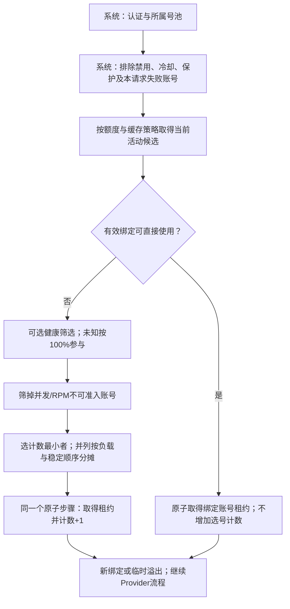

# 可视化选号工作流与计数均衡：设计草案

状态：用户已确认三个关键决策，正在隔离分支 `codex/selection-workflow` 实施与验证；尚未修改线上。产品源仓库：`/Users/lyh_god/GolandProjects/cline-pass-switcher`，实施工作树：`/Users/lyh_god/orca/workspaces/cline-pass-switcher/selection-workflow`。

## 已确认的目标

用户希望在UI中直接看懂并操作真实选号流程，避免配置列表顺序与后端隐藏分支不一致。已明确选择受约束的流程图，而非任意n8n式画布；认证、所属号池和并发预占等系统保护固定。

用户对新选号器的明确规定：**只在当前活动缓存池里，选“选号次数最少”的可用账号；选中后该账号计数+1。直接命中会话绑定不计数。** 这应实现为“计数轮询/最少选号次数”，不能偷换成传统游标轮询、最少实时连接或健康度最高优先。

未知账号健康度按100%参与选路。观察到的健康统计仍保留“未采样/无数据”，不伪造成功请求或样本。当前已知统计缺陷修复不在本改动中暗自捆绑。

## 先澄清额度的最小值与最大值

当前输入是三个窗口的已用百分比，所以取最大值才代表最紧张窗口；如果换成剩余百分比，则取最小值。二者满足 `最小剩余比例 = 100% - 最大已用比例`。

例如已用90%、20%、10%，剩余10%、80%、90%，瓶颈是10%剩余。不能将当前代码直接改为“最小已用10%”，否则会把接近耗尽的账号误认为仍很充裕。UI建议统一显示“最小剩余比例”，底层保持等价计算；不同窗口的绝对美元/Token总额度不是百分比算式能直接替代的。

## 方案选择

| 方案 | 结果 | 取舍 |
| --- | --- | --- |
| 只改现有表单/三步排序 | 可以加参数，仍难表达绑定分支和系统守卫 | 不满足用户的流程图目标 |
| 受约束流程图 | 支持策略节点、明确分支、参数编辑和真实执行轨迹 | 用户已选择；复用现有单页UI和后端状态所有者 |
| 任意自由连线 | 可组合大量自定义逻辑 | 本期不做；验证、迁移、循环与状态一致性成本明显更大 |

## 默认新流程



无名额时仍走有界等待/合法扩池/明确拒绝，不通过图节点绕过上限。真实Provider调用、错误分类、停止规则与释放租约继续由现有生命周期所有者负责。

### 候选范围与健康的作用

- 轮询范围是当前客户端Key所属池中的**活动缓存成员**，不是所有启用账号，也不会跨owner借号。
- 禁用、冷却、硬隔离、额度保护、排除名单、并发和RPM仍然约束选择。
- 计数选号比较的是节点收到的全部可准入活动候选，不能在它之前悄悄按精确健康值切成一个头部账号组。
- 新模板将健康作为可解释的评分/可选筛选，而不是默认精确分层。用户未指定健康阈值，不擅自写死阈值。
- 缓存成员仍可按现有额度方式产生。若希望额外施加“低额度优先选择”等业务优先级，必须作为图中显式节点或分支展示其候选范围，不能隐藏在计数选择之前。
- 默认新模板保留有效绑定，不因另一账号健康更高而迁移。旧策略模板保留原有行为供兼容；新模板的角色优先与临时溢出语义在应用预览中明确显示。

### 未知健康100%的精确定义

`observedSuccessRate`无样本时仍为null；`effectiveRoutingHealth`按用户政策取1。UI显示“未采样 · 按100%参与选号”，同时显示样本0。

这个默认只作用于账号选号，不自动改变Provider的未知健康处理。使用计数选择器时，健康值本身不再决定排位；在健康筛选或用户另选健康优先选择器时才按该有效值参与。

## 选号计数契约

计数按稳定账号ID持久保存，候选选择始终受所属Key隔离；不按账号显示名称匹配。所有候选比较、租约检查、预占与计数更新之间不插入await，复用现有activeCounts/RPM租约所有者，避免多请求同时读到同一个旧计数。

| 场景 | 是否计数 |
| --- | --- |
| 新会话/失效绑定重新选号且取得租约 | 所选账号+1 |
| 有效绑定直接复用原账号 | 不增加 |
| 绑定账号忙，真正重新选择另一个账号临时溢出 | 新选账号+1，原绑定仍按策略保留 |
| 首包前错误导致换账号，选到替代账号 | 替代账号+1；原账号此前计数不回退 |
| 同一账号内从一个Provider尝试另一个Provider | 不增加 |
| 没选出账号、预占失败、只等待 | 不增加 |
| 预览、模拟、刷新页面 | 不增加，也不推进并列决胜顺序 |
| 取得租约后上游失败或客户端取消 | 不回退，计数衡量分配而非成功 |
| 管理员强制指定某账号、额度刷新 | 不因绕过该选择器而增加 |

并列最小计数时，建议先选当前占用更低者，仍并列再做稳定轮转；主条件始终是最少选号次数。某个低计数账号忙时先跳过，不让它堵住其他可用账号；释放后再次参与。

此算法均衡的是重新选号次数，而不是总请求数、Token、费用或实时负载。绑定命中多的账号仍可能承担更多流量。新账号从0开始或低计数备用账号进入活动池时，会优先追赶旧计数；不擅自把它改成虚拟基线或伪造历史计数。

**用户已确认：计数跨重启保存并恢复，提供明确重置，新账号从0开始。** 不从历史HTTP请求总数回填，因为历史包含大量绑定命中和Provider重试。

同ID账号暂停、离开活动集合再回来，保留计数；改名称不重置。重置按明确选择的号池范围执行并展示数量，不默认只清活动成员而留下备用成员旧值；不清除会话绑定，也不改变在途租约。计数沿用现有server状态所有者与原子写函数，以selection-counters.json小快照逐次落盘，正常重启恢复；该文件优先于metadata中的兼容镜像，仅缺失时导入旧镜像，损坏则拒绝启动；保存异常必须可见，不能伪称已持久化或将其伪造成上游429。实现与测试需验证持久化开销，避免把整份统计写盘放大到新的热点。

新工作流中的真实自动选号在获得租约时计数，统计与具体选择器分离；计数选择器读取同一真实计数。直接复用绑定以及同账号内Provider回退不产生新的选号事件。

## UI操作与执行的一致性

采用现有页面中的策略编辑区域，替换仅能排列三个名称的线性列表：

```text
策略版本 / 草稿状态                         校验  模拟  保存应用
节点库           流程图                         节点属性
额度/缓存        系统过滤 → 活动池 → 绑定门       候选范围
健康处理                         ├ 命中          未知健康=100%
计数选号                         └ 未命中        计数/并列策略
等待/拒绝               健康筛选 → 计数选号       等待与分支参数

模拟结果：每步候选数量、排除原因、预测账号；不修改真实计数
真实请求：按请求ID显示执行分支、计数前后值、账号/Provider尝试
```

- 中间是有命中/未命中、可用/满载、错误处置分支的流程图。
- 支持拖动的节点只能放入类型兼容的位置；提供键盘上移/下移和属性面板，不依赖拖拽才能操作。
- 固定系统节点展示但不能删除或挪过保护边界。
- 节点参数明确展示实际作用范围，例如“仅未命中分支”“当前活动池”“未知健康默认100%”。
- 每个选号分支只能有一个最终选择器。不能让“精确健康优先”暗中覆盖“最少计数”而图上仍显示均衡。
- 编辑只改草稿。提供校验、无真实模型调用的模拟、保存应用和放弃草稿（恢复最近载入的已保存配置；不提供服务端历史版本回滚）。
- 模拟展示每个节点前后候选数及排除原因；明确标为预测，不占用真实租约或计数。
- 旧版兼容流程和新计数均衡流程作为清晰模板；切换模板必须展示语义变化。

选号图与错误/重试子流程分开呈现但可跳转关联，防止把“换账号”和“换Provider”画成同一个动作。传输连接池属于实例级设置，不伪装为每请求可拖动的选号节点。

## 后端与配置边界

- 前后端共用受支持节点类型和参数契约，后端仍是最终验证者；拒绝未知节点、非法连线、无终点和无界循环。
- 用一种规范化工作流配置作为新策略权威来源，避免图、旧三个开关、原始JSON成为相互覆盖的多套状态。
- 旧配置先按原语义导入兼容模板，不在升级时悄悄切成新算法。既有账号ID、owner、key、note、proxyUrl、headers、perModel、开关与限额必须完整保留。
- 保存具有配置版本/修订校验，防止另一页面或会话修改后旧草稿覆盖新配置。当前线上配置在审查期间确有用户侧保存变化，因此需要保留这一防冲突边界。
- 同一请求使用明确的策略版本；所有权撤销、账号硬状态和租约资格仍以当前有效状态重新检查，不能因旧流程快照越权。
- 配置迁移、旧客户端保存兼容及回滚必须单独验证，不直接把新格式交给不认识它的旧镜像。

## 日志设计与现有证据

现有普通日志已经包含requestId、switched、account/Provider路径、attemptIndex、ruleId/scope/action、retryDecision等，足以分辨换号与Provider回退。新增流程应记录有界的策略版本、经过节点ID、分支原因和选号计数前后值，不保存原始会话ID、指纹、请求正文或凭据。

2026-09-30补查旧80并发样本：对应20条错误记录的targetProvider全部是deepseek。请求 `94d1d43d-bd1b-45d6-a438-904746761271` 的attempt0和attempt1都指向deepseek，均命中general-429/account/cooldown，retryDecision=continue。该请求先前的账号路径为旧批次匿名P21→P27。不能把两次相同Provider误当成没有换账号。

另在服务器内只比较启用凭据的摘要，46个启用配置项未发现重复凭据；摘要和密钥均未导出。本请求换号会排除自己的旧账号ID，不会立刻选回它。其他请求可以选择同一个替代账号；未来的新请求在账号恢复后也可以再次使用它。

## general-429如何收窄（提议，未改线上）

不再用“所有429→账号冷却”笼统覆盖未知归属。现有配置可先保留明确TPM规则，移除或改成有明确账号证据条件的广义账号冷却；真正账号额度错误仍需走归属与额度保护路径。不能编造未验证的上游错误文本来作为永久条件。

对本次已证实的非结构化429，可增加针对当前规范化错误文本的停止规则，避免本请求立即换Provider/换账号重复尝试：

```json
{
  "id": "stop-unstructured-429",
  "decision": "stop",
  "when": {
    "statuses": [429],
    "body_contains": "upstream returned an invalid error response"
  }
}
```

这不是“所有429都停”，也不是判断所有HTML429必然来自IP。它只处理已观察到的该类响应；不解除第一次上游拒绝，不自动暂停后续新请求。共享出口退避/统一入场预算若要加入，是明确的新能力，不能冒充现有规则已经具备。

只加retry-stop而保留general-429，账号仍会先被冷却。设计中的错误处理节点应清晰分开错误归属、健康/冷却动作和继续/停止决定；可增加按已验证归属匹配的条件，但当前UI还不支持该条件，不能把提议字段直接粘贴进现有配置。

最新只读快照还有一条stop-400，其body_contains仍为replace-me。状态和正文是AND，故这不表示“全部400停止”；新UI应把这种未替换条件明显展示，不能静默认为规则已经生效。

## maxSockets的归属与调整

256是项目给Node直连HTTP(S) Agent设置的默认值，不是Cline声明的账号配额。当前可通过 `CLINE_PASS_DIRECT_MAX_SOCKETS` 配置1～1024；例如512可作为后续500并发测试的候选值，但需要单独验证资源和上游表现。

0或超出范围不是“无限制”，现代码会回退默认256。此参数启动时读取，环境变量变更通常需要重建/重启实例。调高不会解除共享上游429。本设计阶段不改该值，不执行部署。

## 验收要点

- 18个同等可用活动账号连续分配N个新会话，计数最大差不超过1；绑定命中不会推进该计数。
- 并发新会话的计数比较、租约与更新不会出现重复读取旧最小值导致超额；上限、owner、禁用/冷却排除保持有效。
- 同账号Provider重试不增加；真正换号和临时溢出各计一次；未准入不增加；失败后不退还。
- 未知健康按100%进入路由判断，但样本保持0/未知；Provider的未知处理不受影响。
- 健康分组和低额度优先不再隐藏地覆盖计数选择范围；任何显式优先节点都在图和模拟结果中可见。
- 旧绑定仍按用户选择的语义复用；失效/撤销/成员变更后安全重新选号。
- 图编辑、JSON、后端执行和请求日志能够互相对应；草稿和版本冲突不会丢失账号配置。
- 旧配置导入不改变运行行为，非法图不能保存，模拟不发模型请求且不改变计数。
- 本地mock和真实UI验证完成后，才另行处理部署与有边界的线上验证。
